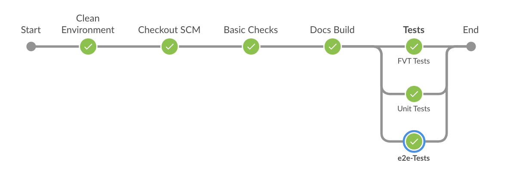

# Continuous Integration Process

This document explains the fabric-ca Jenkins pipeline flow and FAQ's on the build process to help developer to get more femilarize with the process flow.

To create CI jobs, we use JJB (Jenkins Job Builder) to create jobs in Jenkins. Please see the pipeline template job description here https://ci-docs.readthedocs.io/en/latest/source/pipeline_jobs.html#job-templates

- Every Gerrit patchset triggers a verify job and run the below tests from `Jenkinsfile`

    - Basic Checks (make checks)
    - Documentation build (tox -edocs)
    - Unit tests (make unit-tests)
    - FVT tests (make fvt-tests)
    - E2E tests

All the above tests run on the Hyperledger infarstructure x86_64 build nodes. All these nodes uses the packer with pre-configured software packages. This helps us to run the tests in much faster than installing required packages everytime.

Below steps shows what each does in the Jenkins pipeline verify and merge flow. Every Gerrit patchset triggers the fabric-ca-verify-x86_64 job and runs the below tests on x86_64 platform. Before execute the below tests, it clean the environment (Delete the left over build artifiacts) and clone the repository with the Gerrit Refspec.

#### Basic Checks

- We run `make checks` target to run the basic checks before kickoff the actual tests.
- It's run against every Patchset. Patchset fails if any of the checks are faile
- You can run basic checks locally:

    - make checks (Runs all check conditions (license, format, imports, lint and vet)

#### Docs Build

- We run `tox -edocs` from the root directory.
- Displays the output in the form of HTML Publisher on the `fabric-ca-verify-x86_64` job. Click on **Docs Output** link on the build log.

#### Unit Tests

- We run `make unit-test` target to run the go based unit-tests

#### FVT Tests

- We run `make fvt-tests` target to run the fvt tests. Which includes postgres, mysql related tests in it.

#### E2E tests

- We run **e2e tests** in the **merge job** and it performs the following tests.
    - The intention of running e2e tests as part of the merge job is to test the dependent tests of fabric-ca. Execute below tests
        - fabcar
        - fabric-sdk-node - We run **gulp run-end-to-end** target which executes most of the end to end tests
        - fabric-sdk-java - We run **ci_run.sh** script pre-baked in fabric-sdk-java repository.

### Supported platforms

- x86_64 (Run the tests on verify and merge job)
- s390x (Run the tests as part of daily job)

### Build scripts

- We use global shared library to reduce the redundant code and maintain the common code in a ci-management repository. Please see the code updated here https://github.com/hyperledger/ci-management/tree/master/vars

- Look at the `Jenkinsfile` placed in the root directory of this project.

### CI Pipeline flow

As we trigger `fabric-ca-verify-x86_64` pipeline job for every gerrit patchset, we execute the tests in the below order.

CleanEnvironment -- OutputEnvironment -- CloneRefSpec -- BasicChecks -- DocsBuild - Tests (Unit Test , FVT Tests)
**[VERIFY FLOW]**

CleanEnvironment -- OutputEnvironment -- CloneRefSpec -- BasicChecks -- DocsBuild - Tests (E2E, Unit, FVT Tests)
**[MERGE FLOW]**

After the DocsBuild is passed, Jenkins Pipeline triggers Unit and FVT Tests parallel on two different nodes. After the tests are executed successfully it posts a Gerrit voting on the patchset.
If DocsBuild fails, it send the result back to Gerrit patchset and it won't trigger the further builds.

See below **FAQ's** to contribute to CI changes.

### What happens on the merge job?

After the patchset got merged in the fabric-ca repository, it follows the above pipeline flow and executes the e2e tests in parallel to the Unit and FVT Tests.

Jenkins clones the latest merged commit and runs the below steps

- Build fabric, fabric-ca images & Binaries
- Pull Thirdparty Images (Couchdb, zookeeper, kafka)
- Pull javaenv, nodeenv images from nexus3 (latest stable images published after successful merge job of each repo)
  - fabcar tests
  - fabric-sdk-node (npm install, gulp run-end-to-end)
  - fabric-sdk-java (Run ci_run.sh)

### What happens if one of the build stage fails?

As we are running these tests in `fastFailure: true` (if any build stage fails in the parallel process, it will terminate/abort the current running tests and sends the result back to the Gerrit Patchset. This way, CI will avoid runnning tests when there is a failure in one of the parallel build stage.

It shows `aborted` on the aborted stage on pipeline staged view.

### How to re-trigger failed tests?

With this pipeline flow, you can not re-trigger specific failed job, instead you can post comments `reverify` or `reverify-x` on the gerrit patchset to trigger the `fabric-ca-verify-x86_64` job which triggers pipeline flow as mentioned above. Also, we provided `remerge` or `remerge-x` comment phrases to re-trigger the failed merge jobs.

### Where to see the output of the stages?

Piepline supports two views (stages and blueocean). Staged views shows on the Jenkins job main page and it shows each stage in order and the status. For better view, we suggest you to access BlueOcean plugin. Click on the JOB Number and click on the **Open Blue Ocean** link that shows the build stages in pipeline view.

### How to add more stages to this pipeline flow?

We use scripted pipeline syntax with groovy and shell scripts. Also, we use global shared library scripts which are placed in https://github.com/hyperledger/ci-management/tree/master/vars. Try to leverage these common functions in your code. All you have to do is, undestand the pipeline flow of the tests, add more stages as mentioned in the existing Jenkinsfile.

### How will I get build failure notifications.

On every merge failure, we send an build failure email notications to the submitter of the patchset and send build details to the Rocket Chat **jenkins-robot** channel. Check this here https://chat.hyperledger.org/channel/jenkins-robot

### What steps I have to modify when I create a branch from master?

As the Jenkinsfile is completely parametrzed, you no need to modify anything in the Jenkinsfile but you may endup modifying ci.properties file with the Base Versions, Baseimage versions etc... in the new branch.

### How to reach out to CI team?

Post your questions or feedback in #ci-pipeline or #fabric-ci Rocket Chat channels.

### Build Scripts

We use global shared library scripts and Jenkinsfile along with the build file.

Global Shared Library - https://github.com/hyperledger/ci-management/tree/master/vars

Jenkinsfile           - https://github.com/hyperledger/fabric-sdk-node/tree/master/Jenkinsfile

ci.properties         - https://github.com/hyperledger/fabric-ca/tree/master/ci.properties
(ci.properties is the only file you have to modify with the values requried for the specific branch.)

Packer Scripts        - https://github.com/hyperledger/ci-management/blob/master/packer/provision/docker.sh
(Packer is a tool for automatically creating VM and container images, configuring them and post-processing them into standard output formats. We build Hyperledger's CI images via Packer and attach them to x86_64 build nodes. On s390x, we install manually. See the packages we install as a pre-requisite in the CI x86 build nodes.)
